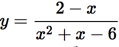

### Математика и Геометрия

- Задан треугольник со сторонами **_A = 4, B = 5 , C = 6_**. Найти площадь треугольника 
по формуле [Герона](https://ru.wikipedia.org/wiki/%D0%A4%D0%BE%D1%80%D0%BC%D1%83%D0%BB%D0%B0_%D0%93%D0%B5%D1%80%D0%BE%D0%BD%D0%B0).
- Вычислить площадь круга. Данные дожны вводиться из консоли, пользователю должно 
предлагаться два варианта на выбор. Либо ввод радиуса круга либо диаметра. Результат вывести
пользователю на консоль в округленном виде до 2-х знаков после запятой.
- Задан отрезок **_[a, b]_**. Определить что введенное из консоли значение находится на этом отрезке.
- В декартовой системе координат задан треугольник с координатами точек **_A(0,0) B (5, 6) C(0, 10)_**.
Вычислить периметр и площадь треугольника.
- В декартовой системе координат задан квадрат _**A(10, 10) B (-10 , 10) C(-10, -10) D (10, -10)**_.
Определить находится ли введенная с консоли точка внутри заданного квадрата.
- Задана функция **y = sin2x**. Построить таблицы значений **x,y** на промежутке **[0.2, 0.4]**
с шагом **0.01**. Результатом должно быть два массива, один который хранит **x** значения функции,
второй хранит **y**.
- Задана функция . Вывести на консоль значения
точек **(x,y)** на интервале **x [10, 100]** с шагом **1.5**
- Пользователь вводит с консоли число в десятеричном формате. Подсчитать сколько единиц введенное
число содержит в двоичном формате

    _Например_

    ```
    Пользователь вводит число 5. В двоичном виде это 101 -> ответ 2
    ```

### Циклы

- Пользователь вводит из консоли значение размера стороны квадрата.
Нужно вывести на консоль в виде _*_

    _Например_
    
    Пользователь вводит с консоли 6 (размер стороны квадрата)
   ```
    ******
    *    *
    *    *
    *    *
    *    *
    ******
    ```
- Построить пирамиду в консоли, в зависимости от того какое значение основания пирамиды
 вводит пользователь (значения должны быть нечетными и начинаться с числа **3**)

    _Например_
    
    Пользователь вводит значение 7, на консоли должен быть следующий вывод
    
    ```   
          *  
         ***
        *****
       *******
       
       А также вывести зеркальное отражение
       
       *******
        *****
         ***
          *
    ```
- Построить ромб в консоли в зависимости от введенного пользователя значения длинны
    горизонтальной диагонали (значения должны быть нечетными и начинаться с числа **3**)
    
    _Например_
    
    ```
    Пользователь ввел значение 5 для диагонали, но консоли должен быть следующий вывод
    
        *
       ***
      *****
       ***
        *
    ```
- Построить два треугольника в консоли, в зависимости от размера введенного
пользователем длинны катета (значения должны быть нечетными и начинаться с числа **3**)

    _Например_
    
    ```
    Пользователь ввел значение 5
    
    *                *
    **              **
    ***            ***
    ****          ****
    *****        *****
    ```
- Всеми известными циклами вывести на консоль фигуру, в зависимости от введенного
пользователем значения диагонали

    _Например_
    
    ```
    Пользователь вводит значение 5, на консоли долно отобразиться
    
    *
    **
    ***
    ****
    ***** - диагональ со  значением 5
    ****
    ***
    **
    *
    
    И также вывести зеркальное отображение
    
            *
           **
          ***
         ****
        ***** - диагональ со  значением 5
         ****
          ***
           **
            *
    ```
- С помощью всех известных циклов вывести на консоль
    ```
            *        *
            *        *
            *        *
            **********
            *        *
            *        *
            *        *
    ```

- С помощью всех известных циклов вывести на консоль

    ```
        *                       *
        *                       *
        *                       *
        *                       *
        *                       *
        *                       *
        *************************
    ```

- С помощью всех известных циклов вывести на консоль
    ```
    ***************************
    *
    *
    *
    *
    *
    *
    *
    *
    *
    *                          *
    *                          *
    ```

- С помощью всех известных циклов вывести на консоль
    ```
    *************           *
    *           *           *
    *           *           *
    *           *           *
    *           *           *
    *           *           *
    *           *           *
    *           *           *
    *           *************
    ```

### Строки

- Ввести с консоли три строки. Нужно получить новую строку, которая будет содержать все предыдущие строки.
- Задана строка. Определить количество символов строки и вывести на консоль.
  Далее все символы строки преобразовать в верхний регистр.
- Задана строка, каждый символ в строке преобразовать в [ASCII](http://www.asciitable.com/) код (десятиричный), 
    и получить суму все этих кодов.
    
    _Например_
    
    ```
       String str = "ABc"
       
       десятиричный код 'A' - 65
       десятиричный код 'B' - 66
       десятиричный код 'c' - 99
       
       результат 65 + 66 + 99 = 230
    ```
- Задана строка
    ```
    String str = "Java Programming"
    ```
    Сконвертировать данную строку в массив **char[]** и вывести на консоль
- Сгенерировать миллион строк, каждая строка должны содержать от 10 до 1000 символов, 
    размер строки тоже должен быть случайный но в заданном выше диапазоне. Для хранения всех этих
    строик использовать массив. Далее подсчитать колличество символов во всех строках массива.
- Задана строка
    ```
    String str = "variable";
    ```
   Поменять местами группы символов по 2
   
   _Например_
   
   ```
   String example = "java"   => "ajav" 
   ```
- Сделать реверс строки
    ```
    String str = "The Java Virtual Machine"
    ```
    
    _Например_
    
    ```
    String example = "java" => "avaj"
    ```
    
- Написать программу которая определяет является ли введенная строка палиндромом
    
    _Например_
    
    ```
    "Anna", "Civic", "Kayak", "Racecar" => палиндромы
    "java", "maven", "git", "programming" => не палиндромы
    ```
- Задана строка
    ```
    String str = "The Java programming language is a relatively high-level language, in that details of the machine representation are not available through the language.";
    ```
    Из данной строки нужно получить строку которая будет состоять из первых символов слов
     данной строки-предложения
     
     _Например_
    ```
        String example = "Hello, World!" => "HW"
    ```
- Задана строка
    ```
    String str = "The Java programming language is strongly and statically typed"
    ```
    Найти сколько раз символ _**'a'**_ встречается в данной строке
- Заданы два алгебраических уравнения в виде строки
    ```
    String equation1 = "(a + b) * (b + c)";
    String equation2 = "(a + b) * (b + c) - (а + 4 + r))";
    ``` 
    Проверить два уравнения на валидность (в данном случае валидность воспринимать как
    колличество открытых и закрытых скобок в уравнении)
- Задана строка
    ```
    String str = "The Java programming language is strongly and statically typed."
    ```
    Преобразовать строку таким образом, чтобы каждый парный символ входил в новую строку
    
    _Например_ 
    
    ```
    String example = "test"
    ```
    Результат должен быть **_"et"_**
    
- Задана строка
   ```
   String str = "Java Programming"
   ```
   После каждого символа в строке вставить например символ '1'
   
   _Например_
   
   ```
   String example = "java" => "j1a1v1a1"
   ```
- Задана строка-предложение
    ```
    String str = "The Java programming language is a general-purpose, concurrent, class-based, object-oriented language."
    ```
    Разбить данную строку на слова-подстроки и записать все в массив и вывести на консоль.
    При этом все знаки препинания должны быть удалены
    
    _Например_ 
    
    ```
    String example = "Hello, world!";
    ```
    
    Результатом должен быть массив из дву строк: **_"Hello" and "world"_**.
- Задана строка
    ```
    String str = "2347865238";
    ```
    Выполнить перемножение двухзначных чисел
    
    _Например_
    
    ```
    String example = "1134" => 11 * 34 = 374
    String example = "10112233" => 10 * 11 * 22 * 33
    ```
    
- Задана строка
    ```
    String str = "iuqheiuehrg7jh34hj234jh5y287b23jhbhj34thj2b34thj";
    ``` 
    Определить сколько строка имеет цифровых символов
    
    _Например_
    
    ```
    String example = "asdfj345jkjh2k2"; => 34522 => 5 символов
    ```
- Задана строка
    ```
    String str = ""Hello, Java!";
    ```
    Строка должна быть так преобразована чтобы каждый символ в ней был не еденицу меньше в
    десятичной системе ASCII.
    
    _Например_
    
    ```
    String example = "loL";
    
    l - ASCII code 108 => 108 - 1 = 107 is code k
    o - ASCII code 111 => 111 - 1 = 110 is code n
    L - ASCII code  76 => 76 - 1 = 75 is code K
    
    String out = "knK"; 
    ```
- Задана строка
    ```
    String str = "sdgHjhgJHGHJggSLsjLKSkjhkjhSjhkSkhsk:LkS"
    ```
    Определить колличество символов в верхнем регистре
    
    _Например_
    
    ```
    String example = "abcEljkR" => 2
    ```
- Задан миссив трок
    ```
    String[] array = {
                        "java",
                        "maven",
                        "git",
                        "programming",
                        "svn"
                    }
    ```
    Результатом должна быть строка которая будет содержать в "склееном" виде строки из
    массива таким образом, что каждое "склеивание" должно происходить не вконец 
    предыдущей строки а на метосто предпоследнего символа
    
    _Например_
    
    ```
    String example = {
                        "scala",
                        "python",       
                        go
                    }
        first iteration     => "scala"
        second iteration    => "scalpythona"
        third iteration     => "scalpythongoa"
        
    ```
- Задана строка
    ```
    String str = "JHGJHGhjgHGUYGUYSJJKhjhkjUIUIHJhjhKJHGK";
    ```
    Определить количество символов в нижнем регистре
    
    _Например_
    
    ```
    String example = "ABCdfKILFp" => 3 
    ```

### Mасcивы
- Задан массив
    ```
    int[] array = {1, 4, 6, 7, 34, 2, 12}
    ```
    Вывести в консоль все его элементы в обратном порядке 
- Задан массив
    ```
    byte[] array = {3, 6, 5, 7, 34, 99, 6, 8, 32, -20, 45, -100}
    ```
    Найти наибольший и наименьший элементы массива
- Задан массив
    ```
    short[] array = {4, 5, -23, -1234, 456, 7, -44, -1, 45, 23, 23, 1, 2}
    ```
    Найти наименьшее по модулю значение 
- Заданы два массива символов
    ```
    char[] array1 = {'a', 'v', 't', 'g', 'y', 'd'};
    char[] array2 = {'w', 'g', 'q', 'a', 'k', 'g', 'f', 'v'};
    ```
    Результатом должен быть массив который будет содержать все элементы приведенных
    выше двух массивов, фактически массивы нужно объеденить ("склеить")
- Задан массив
    ```
    int[] array = {4, 5, 456, 24, 23, 231, 231, 2314 ,123, 44, 21, 4}
    ```
    Получить массив double[] на основе входного к элементам которого будет 
    применена операция корня квадратного, результат каждого элемента округлить
    до 3-го знака после запятой
- Задан массив
    ```
    short[] array = {5, 7, 89, 0, 43, 34, 64, 23, 76}
    ```
    Найти [среднее арифметическое элементов](https://ru.wikipedia.org/wiki/%D0%A1%D1%80%D0%B5%D0%B4%D0%BD%D0%B5%D0%B5_%D0%B0%D1%80%D0%B8%D1%84%D0%BC%D0%B5%D1%82%D0%B8%D1%87%D0%B5%D1%81%D0%BA%D0%BE%D0%B5)
- Задан массив
    ```
    long[] array = {6, 4, 32, 432, 13, 54, 6, 56, 7, 6, 5}
    ```
    Найти [среднеквадратичное отклонение элементов](https://ru.wikipedia.org/wiki/%D0%A1%D1%80%D0%B5%D0%B4%D0%BD%D0%B5%D0%BA%D0%B2%D0%B0%D0%B4%D1%80%D0%B0%D1%82%D0%B8%D1%87%D0%B5%D1%81%D0%BA%D0%BE%D0%B5_%D0%BE%D1%82%D0%BA%D0%BB%D0%BE%D0%BD%D0%B5%D0%BD%D0%B8%D0%B5)
- Задан массив
    ```
    int[] array = {1, 4, 4, -356, 23, 324, 4, 4, -7, 8, 9, 0, -99999}
    ```
  Найдите сумму отрицательных элементов массива по модулю
- Найдите сумму **1 + 2 + 3 + … + n**, где число **n** вводится пользователем с клавиатуры.
- Задан массив строк
    ```
    String str = {"apple", "java", "git", "maven", "programming", "algorithm"}
    ```
    Результатом должен быть массив **int** элементы которого должны содержать количество
    символов соотвесттвующего элемента массива строк
    
    _Например_
    
    ```
    String example = {"python", "Go"} => int[] array = {6, 4}
    ```
- Задан массив
    ```
    int[] array = {2, 4, 15, 17, 45, 23, 5, 47 ,543, 234, 5 345, 23, 1}
    ```
    Вывести на консоль те элементы которые принаджежат интервалу [16, 300]
    
    _Например_
    
    ```
    int[] example = {5, 4, 6, 3, 7} интервал [6, 8] => 6, 7
    ```
    
- Задан массив
    ```
    int[] array = { 1, 2, 4, 5, 3 , 1, 5, 10};
    ```
    Определить и найти если есть в данном массиве уникальный элемент (возможно несколько)
    
    _Например_
    ```
    int example = {1, 4, 6, 1, 4} => один уникальный элемент 6
    ```    
- Задан массив 
    ```
    int[] array = {4, 5, 6, 34, 435, 32, 4, 6}
    ```
    Получить вертикальное представление данного массива (Это будет двухмерный массив)
    
    _Например_
    
    ```
    int[] example = {1, 2, 3}
                
    
    int[][] example = {
        {1}, 
        {2},
        {3}
    }
    ```
- Задан массив
    ```
    int[] array = {2, 4, 5, 76, 3, 4, 6, 6, 3 4 2, 43, 234, 342, 2, 3 45, 23, 46};
    ```
    Вычислить сумму всех парных значений массива
    
    _Например_
    
    ```
    int[] example = {10, 2, 5, 8} => 10 + 2 + 8 = 20
    ```
- Задан массив
    ```
    byte[] array = {4, 5, 6, 4, 3, 12, 14, 16, 23, 24, 53 , 55, 45, 67, 33, 34, 44}
    ```
    Удалить из массива те элементы которые не входят в интервал **[15, 35]**
- Задан массив
    ```
    int[] array = {14, 63, 45, 75, 15, 4356 , 23, 12, 213, 1, 2341234, 23,  21, 77, 48}
    ```
    Создать массив который будет содержать элементы заданого массива, которые находятся в 
    диапазоне [15, 46] включительно.
    
    _Например_
    
    ```
    int[] example = {4, 6, 7, 9, 10} => диапазон [5, 9] => int[] out = {6, 7}
    ```
- Задан двухмерный массив чисел
    ```
        int[][] array = {
                        {1},
                      {4, 6},
                    {5, 4, 2},
                  {9, 5, 4, 7},
                {0, 4, 3, 4, 3},
              {4, 2, 1, 5, 6, 7},
            {5, 7, 8, 4, 2, 2, 3}
        }
    ``` 
    Нужно получить новый массив который будет зеркальным отражением относительно вертикали
    
    _Например_
    
    ```
        int[][] example = {                 int[][] example = {
                {1},                                {1},
              {5, 4},                 =>          {4, 5},
            {6, 7, 4}                           {4, 7, 6}    
        }                                   }
    ```
    Решить задачу общим случаем, т.е. для любого размера двухмерного массива
- Заданы массивы
    ```
    int[] array1 = {5, 4, 6, 8, 9, 3, 4};
    int[] array2 = {6, 7, 8, 9, 4, 5, 3}
    ```
    Нужно элементы массива поменять местами, по такому принципу что первый
    элемент первого массива менятюся местом с вторым элементов второго массива.
    И второй элемент первого массива меняется местом с первым элементом второго массива.
    И так далее по парно
    
    _Например_
    
    ```
    int[] example1 = {1, 2, 3, 4}   =>  {6, 5, 8, 7}
    int[] example2 = {5, 6, 7, 8}   =>  {2, 1, 4, 3} 
    
    ```
    
- Заданы два массива
   ```
   long[] array1 = {345, 3, 45, 4, 5, 1, 55, 45, 54, 33, 34, 49}
   long[] array2 = {4100, 3, 6, 7, 54, 49, 1}
   ```
   Выполнить операцию пересечения множеств-массивов. Массив пересечения должен
   содержать только те элементы которые есть и в первом и во втором массивах.
   
   _Например_
   
   ```
   long[] example1 = {1, 2, 3, 4}
   long[] example1 = {3, 4, 5, 6}       
   
   long[] intersection = {3, 4}
   ```
   
- Задана матрица размера **_N x N_** (Двухмерный массив элементы которого **int**). 
    В данной матрице есть две диагонали. Нужно получить сумму всех элементов диагонали. 
    
    _Например_ 
    
    Расмотрим матрицу **_3x3_**
    ```
    | 4 | 2 | 3|
    | 3 | 8 | 4|   одна диагональ 4 + 8 + 6, вторая диагональ 3 + 8 + 5
    | 5 | 1 | 6| 
    ```
- Задан куб _**N x N x N**_. найти произведение элементов по всем 4-м диагоналям.

    _Например_ 
    
    Куб _**3 x 3**_
    ```
    int[][][] cub = {
            {
                    {1, 2, 3},
                    {4, 5, 6},
                    {7, 8, 9}
            },
            {
                    {10, 11, 12},
                    {13, 14, 15},
                    {16, 17, 18}
            },
            {
                    {19, 20, 21},
                    {22, 23, 24},
                    {25, 26, 27}
            }
    }
    
    первая диагональ    1 * 14 * 27
    вторая диагональ    3 * 14 * 25
    третья диагональ    19 * 14 * 9
    четвертая диагональ 21 * 14 * 7
    ```